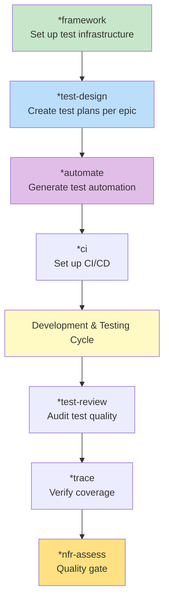

# Content Creation Module - Testing & Validation Guide

**Created:** 2025-11-13
**Module Version:** 2.0.0 (Phase 2 Complete)
**BMAD Version:** v6 Alpha 9

---

## Overview

This guide provides comprehensive information on automating the validation and testing of the Content Creation module's 135 components (17 agents, 8 workflows, 43 tasks). It covers available BMAD v6 testing capabilities, recommended strategies, and automation approaches.

**Related Documentation:**
- [Deep-Dive Analysis](./deep-dive-content-creation-module.md) - Complete module architecture
- [Task Tracking](../src/modules/content-creation/TASKS-2025-11-13.md) - Validation checklist

---

## Table of Contents

1. [Testing Automation Options](#testing-automation-options)
2. [Option 1: BMB audit-workflow](#option-1-bmb-audit-workflow)
3. [Option 2: BMM Test Architect (TEA)](#option-2-bmm-test-architect-tea)
4. [Option 3: Custom Validation Workflow](#option-3-custom-validation-workflow)
5. [Recommended Combination Strategy](#recommended-combination-strategy)
6. [Current Limitations](#current-limitations)
7. [Quick Start Guide](#quick-start-guide)
8. [Automation Scripts](#automation-scripts)

---

## Testing Automation Options

BMAD v6 Alpha 9 provides **three complementary approaches** to automate module validation:

| Approach | Purpose | Coverage | Automation Level |
|----------|---------|----------|------------------|
| **BMB audit-workflow** | Workflow configuration validation | 8 workflows | ✅ Fully Automated |
| **BMM TEA workflows** | Test strategy & integration testing | Full pipelines | ⚡ Semi-Automated |
| **Custom validate-module** | Complete module validation | All 135 components | 🔨 Build Required |

---

## Option 1: BMB audit-workflow

**⭐ RECOMMENDED for Component-Level Workflow Validation**

### Purpose

Validate individual workflow quality and BMAD v6 configuration standards compliance.

### What It Tests

✅ **Workflow.yaml Structure**
- Standard config block validation
- Required variables (config_source, output_folder, user_name, etc.)
- Module path configuration
- Web bundle configuration

✅ **Variable Usage Alignment**
- Cross-reference yaml variables with instructions.md
- Cross-reference yaml variables with template.md
- Identify unused variable bloat
- Detect hardcoded values that should be variables

✅ **Config Variable Usage Audit**
- Communication language integration
- User name personalization
- Output folder consistency
- Date handling

✅ **Web Bundle Configuration**
- Completeness check for web-compatible bundles
- Required fields validation
- Dependencies verification

✅ **BMAD v6 Compliance**
- Adherence to v6 standards
- Best practices validation
- Convention compliance

### How to Use

**Manual Execution:**

```bash
# Load BMB builder agent
@bmb

# Run audit workflow
*audit-workflow

# When prompted, provide path to workflow to audit
# Example: src/modules/content-creation/workflows/research-article
```

**Batch Execution:**

See [Automation Scripts](#automation-scripts) section for the bash script that audits all 8 workflows automatically.

### Output

Generates audit report with:
- **Issues by Severity:** CRITICAL, BLOAT, WARNING, INFO
- **Variable Analysis:** Used, unused, misaligned
- **Compliance Score:** Percentage BMAD v6 compliant
- **Recommendations:** Specific fixes required

### Coverage

**Handles from TASKS-2025-11-13.md:**
- ✅ Workflow Validation (8 workflows)
- ✅ Configuration validation
- ✅ Variable usage validation
- ✅ BMAD v6 compliance

**Does NOT handle:**
- ❌ Agent validation
- ❌ Task validation
- ❌ End-to-end workflow execution testing
- ❌ Integration testing

---

## Option 2: BMM Test Architect (TEA)

**⭐ RECOMMENDED for Integration & Pipeline Testing**

### Purpose

Design and execute comprehensive test strategies for module functionality, integration points, and quality assurance.

### Available TEA Workflows

#### 1. **`*framework`** - Test Framework Setup

**When to use:** Phase 3 (Solutioning), after architecture defined

**Purpose:** Set up test infrastructure for the module

**Steps:**
```bash
@tea
*framework

# Specify:
# - Module: content-creation
# - Type: BMAD module (not code project)
# - Test approach: Agent/workflow/task validation
# - Technology: N/A (module testing, not code testing)
```

**Output:** Test framework design document specifying:
- Test infrastructure approach
- Validation strategy
- Tool recommendations
- Reporting mechanisms

#### 2. **`*test-design`** - Test Plan Creation

**When to use:** Phase 4 (Implementation), per epic/workflow group

**Purpose:** Design comprehensive test plan for specific features

**Steps:**
```bash
@tea
*test-design

# For Content Creation module:
# - Epic 1: Text-based workflows (4 workflows)
# - Epic 2: Video workflows (2 workflows)
# - Epic 3: Multi-platform workflows (2 workflows)
# - Epic 4: Agent ecosystem (17 agents)
# - Epic 5: Task library (43 tasks)
```

**Output:** `test-design-epic-N.md` for each epic with:
- Test scenarios
- Validation criteria
- Test data requirements
- Success metrics

#### 3. **`*automate`** - Test Automation

**When to use:** After test-design, before or during implementation

**Purpose:** Generate automated test scripts

**Steps:**
```bash
@tea
*automate

# Generates automation scripts for:
# - Agent menu command validation
# - Workflow execution testing
# - Task input/output verification
# - Integration pipeline testing
```

**Output:** Automated test scripts (format depends on test framework)

#### 4. **`*test-review`** - Test Quality Audit

**When to use:** Before epic completion, optional throughout development

**Purpose:** Audit test quality and coverage

**Steps:**
```bash
@tea
*test-review

# Reviews:
# - Test coverage completeness
# - Test quality (assertions, edge cases)
# - Test maintainability
# - Test documentation
```

**Output:** Test review report with quality assessment

#### 5. **`*trace`** - Requirements Traceability

**When to use:** Throughout Phase 4, at quality gates

**Purpose:** Trace requirements/features to tests (coverage matrix)

**Steps:**
```bash
@tea
*trace

# Creates traceability matrix:
# - Components (agents/workflows/tasks) → Test cases
# - Test coverage percentage
# - Gaps identification
```

**Output:** Coverage matrix showing validated vs pending

#### 6. **`*atdd`** - Acceptance Test-Driven Development

**When to use:** Optional, before dev-story implementation

**Purpose:** Write acceptance tests before implementation

**Steps:**
```bash
@tea
*atdd

# Creates acceptance tests for:
# - Workflow behavior
# - Agent responses
# - Task outputs
```

**Output:** Acceptance test specifications

#### 7. **`*ci`** - CI/CD Pipeline Integration

**When to use:** Phase 3 (Solutioning), after framework

**Purpose:** Set up continuous integration for testing

**Steps:**
```bash
@tea
*ci

# For BMAD module validation:
# - Define CI pipeline
# - Automated validation triggers
# - Quality gate criteria
```

**Output:** CI/CD configuration and integration plan

#### 8. **`*nfr-assess`** - Non-Functional Requirements

**When to use:** Epic/release gates

**Purpose:** Assess non-functional requirements

**Steps:**
```bash
@tea
*nfr-assess

# For BMAD modules:
# - Performance (workflow execution time)
# - Usability (user experience)
# - Maintainability (code quality)
# - Reliability (error handling)
```

**Output:** NFR assessment report

### TEA Workflow for Content Creation

**Recommended TEA workflow sequence:**



### Coverage

**Handles from TASKS-2025-11-13.md:**
- ✅ Integration Testing section
- ✅ Full Pipeline Tests
- ✅ Cross-Workflow Integration
- ✅ Agent Coordination
- ✅ Test strategy design
- ✅ Coverage tracking
- ✅ Quality gates

**Does NOT handle:**
- ❌ Individual agent validation (manual)
- ❌ Task input/output specs (manual)
- ❌ Configuration validation (use audit-workflow)

---

## Option 3: Custom Validation Workflow

**⭐ RECOMMENDED for Complete End-to-End Automation**

**STATUS:** ✅ **CREATED AND READY TO USE!**

### Purpose

The validate-module workflow orchestrates comprehensive validation of all 135 module components.

### Design

**Workflow Name:** `validate-module`

**Type:** Action workflow (no template, validation-focused)

**Location:** `src/modules/content-creation/workflows/validate-module/` OR `src/modules/bmb/workflows/validate-module/`

**Structure:**

```yaml
# validate-module/workflow.yaml
name: "validate-module"
description: "Automated validation of all module components (agents, workflows, tasks)"
author: "Dave Dittrich"

config_source: "{project-root}/src/modules/content-creation/config.yaml"
output_folder: "{config_source}:output_folder"
user_name: "{config_source}:user_name"
communication_language: "{config_source}:communication_language"
date: system-generated

installed_path: "{project-root}/src/modules/content-creation/workflows/validate-module"
instructions: "{installed_path}/instructions.md"
validation: "{installed_path}/checklist.md"
template: false

# Module to validate
target_module_path: "{project-root}/src/modules/content-creation"

# Output
default_output_file: "{output_folder}/validation-report-{date}.md"

standalone: true
```

### Instructions Structure

```markdown
# validate-module/instructions.md

<step n="1" goal="Agent Validation Loop">
  <action>Load agents/ directory</action>
  <action>For each agent .yaml file (17 total):</action>

  <substep n="1a" title="Agent Configuration Check">
    <action>Verify YAML structure</action>
    <action>Check metadata (id, name, title, icon, module)</action>
    <action>Validate persona sections</action>
    <action>Check menu commands</action>
    <action>Verify knowledge file references exist</action>
  </substep>

  <substep n="1b" title="Agent Compilation Check">
    <action>Compile agent to .md format</action>
    <action>Verify output .md file generated</action>
    <action>Check menu command rendering</action>
  </substep>

  <template-output>agent_validation_results</template-output>
</step>

<step n="2" goal="Workflow Validation Loop">
  <action>Load workflows/ directory</action>
  <action>For each workflow directory (8 total):</action>

  <substep n="2a" title="Run audit-workflow">
    <invoke-workflow path="{project-root}/{bmad_folder}/bmb/workflows/audit-workflow">
      <param>workflow_path: {{current_workflow_path}}</param>
    </invoke-workflow>
    <action>Capture audit results</action>
  </substep>

  <substep n="2b" title="End-to-End Execution Test">
    <action>Attempt to execute workflow with test inputs</action>
    <action>Verify outputs generated</action>
    <action>Check agent invocations work</action>
  </substep>

  <template-output>workflow_validation_results</template-output>
</step>

<step n="3" goal="Task Validation Loop">
  <action>Load tasks/ directory</action>
  <action>For each task .md file (43 total):</action>

  <substep n="3a" title="Task Structure Check">
    <action>Verify markdown structure</action>
    <action>Check input specification</action>
    <action>Check output specification</action>
    <action>Verify framework references (Carter/Damer)</action>
  </substep>

  <substep n="3b" title="Task Execution Test">
    <action>Execute task with sample inputs</action>
    <action>Verify outputs match specification</action>
    <action>Check framework integration</action>
  </substep>

  <template-output>task_validation_results</template-output>
</step>

<step n="4" goal="Integration Testing">
  <substep n="4a" title="Text Content Pipeline">
    <action>Execute: research-article → format-article → publish-article → promote-content</action>
    <action>Verify: Agent handoffs, data flow, outputs</action>
  </substep>

  <substep n="4b" title="Video Content Pipeline">
    <action>Execute: create-video-assets → publish-video → promote-content</action>
    <action>Verify: Agent coordination, asset generation, outputs</action>
  </substep>

  <substep n="4c" title="Social Media Pipeline">
    <action>Execute: adapt-for-social-media with article/video input</action>
    <action>Verify: Platform outputs, scheduling</action>
  </substep>

  <substep n="4d" title="Framework Integration">
    <action>Execute: analyze-and-respond with both frameworks</action>
    <action>Verify: Carter + Damer simultaneous validation</action>
  </substep>

  <template-output>integration_test_results</template-output>
</step>

<step n="5" goal="Generate Validation Report">
  <action>Compile all validation results</action>
  <action>Calculate completion percentages</action>
  <action>Identify critical issues</action>
  <action>Generate recommendations</action>

  <template-output>final_validation_report</template-output>
</step>
```

### Location

**Workflow Path:** `src/modules/content-creation/workflows/validate-module/`

**Files:**
- `workflow.yaml` - Configuration with validation thresholds and settings
- `instructions.md` - Comprehensive 7-step validation process
- `template.md` - Detailed validation report template
- `checklist.md` - Validation execution checklist

### Usage

```bash
# Load Producer agent
@producer

# Run validate-module workflow
*validate-module

# Select validation mode:
# 1 = Comprehensive (all components + integration)
# 2 = Quick (config validation only)
# 3 = Components Only (agents, workflows, tasks)
# 4 = Integration Only (pipeline testing)

# Workflow automatically:
# - Validates all 17 agents
# - Validates all 8 workflows
# - Validates all 43 tasks
# - Tests integration pipelines (if comprehensive mode)
# - Generates detailed reports
# - Provides prioritized recommendations
```

### Coverage

**Handles from TASKS-2025-11-13.md:**
- ✅ Agent Validation (17 agents)
- ✅ Workflow Validation (8 workflows)
- ✅ Task Validation (43 tasks)
- ✅ Integration Testing
- ✅ Full Pipeline Tests
- ✅ Framework Integration
- ✅ Complete automation

---

## Recommended Combination Strategy

**Best Results: Use All Three Approaches Together**

### Phase 1: Individual Component Validation

**Week 1: Workflow Validation**

```bash
# Use audit-workflow for each workflow
# See automation script in next section
./validate-all-workflows.sh
```

**Week 1-2: Agent Testing**

```bash
# Manual agent testing (load each, test menu commands)
# Script can load agents, but menu testing requires interaction
for agent in src/modules/content-creation/agents/*.yaml; do
  echo "Testing: $agent"
  # Load agent in Claude Code/Cursor
  # Test menu commands
  # Verify knowledge files
done
```

**Week 2: Task Testing**

```bash
# Manual task execution testing
# Organize by category (10 categories, 43 tasks)
# Integrity tasks (3) → Argument tasks (3) → Style (4) → etc.
```

### Phase 2: Test Strategy Design

**Week 3: TEA Framework Setup**

```bash
@tea
*framework

# Set up test infrastructure
# Define validation approach
# Choose tools/methods
```

**Week 3-4: Test Design**

```bash
@tea
*test-design

# Create test plans for:
# - Epic 1: Text workflows
# - Epic 2: Video workflows
# - Epic 3: Multi-platform workflows
# - Epic 4: Agent ecosystem
# - Epic 5: Task library
```

### Phase 3: Automated Execution

**Week 4-5: Test Automation**

```bash
@tea
*automate

# Generate automated tests
# Set up CI/CD integration
```

**Week 5: Coverage Tracking**

```bash
@tea
*trace

# Generate coverage matrix
# Identify gaps
# Track progress
```

### Phase 4: Integration Testing

**Week 6: Full Pipeline Execution**

```bash
# Execute all pipelines end-to-end
# - Text: research → format → publish → promote
# - Video: create-assets → publish → promote
# - Social: adapt-for-social-media
# - Framework: analyze-and-respond (Carter + Damer)
```

**Week 6: Quality Gate**

```bash
@tea
*nfr-assess

# Final quality assessment
# Generate completion report
# Sign-off Phase 2
```

---

## Current Limitations

### What IS Automated in v6 Alpha 9

✅ **Workflow Configuration Validation** (audit-workflow)
- YAML structure checking
- Variable alignment
- Config standards compliance
- Web bundle validation

✅ **Test Strategy Design** (TEA workflows)
- Test framework setup
- Test plan creation
- Test automation generation
- Coverage tracking

✅ **Reporting & Tracking** (TEA workflows)
- Coverage matrices
- Quality assessments
- Traceability reports

### What is NOT Automated Yet

❌ **Agent Menu Command Execution**
- Requires manual loading in IDE
- Menu command testing requires interaction
- Cannot programmatically test agent responses

❌ **Workflow End-to-End Execution**
- Requires manual workflow runs
- Cannot programmatically execute workflows with test data
- Agent invocations require IDE context

❌ **Task Input/Output Validation**
- Requires manual task execution
- No programmatic task invocation API
- Framework integration testing is manual

❌ **Framework Integration Verification**
- Carter/Damer framework application requires manual analysis
- Cannot programmatically verify integrity/argument checks

### Workarounds

**For Agent Testing:**
- Use automation script to generate test checklist
- Manual execution with documented test cases
- IDE automation (if available) for menu command testing

**For Workflow Testing:**
- Use audit-workflow for configuration validation (automated)
- Manual end-to-end runs with documented test scenarios
- TEA test-design to create systematic test plans

**For Task Testing:**
- Categorize by framework (Integrity, Arguments, Style, etc.)
- Manual execution with test inputs
- Document results systematically

---

## Quick Start Guide

### Immediate Actions (This Week)

**1. Audit All Workflows (Automated)**

```bash
# Run the automation script (created below)
chmod +x validate-all-workflows.sh
./validate-all-workflows.sh
```

**2. Set Up TEA Framework**

```bash
@tea
*framework

# Answer prompts:
# - Module: content-creation
# - Type: BMAD module
# - Validation focus: agents, workflows, tasks
```

**3. Create Test Plan**

```bash
@tea
*test-design

# Create test plans for each epic:
# - Epic 1: Text workflows
# - Epic 2: Video workflows
# - etc.
```

**4. Generate Coverage Baseline**

```bash
@tea
*trace

# Track current validation status
# Identify gaps
# Set priorities
```

### This Month

**Week 1: Component Validation**
- Run audit-workflow automation (Day 1)
- Manual agent testing (Days 2-3)
- Manual task testing (Days 4-5)

**Week 2: Test Strategy**
- TEA framework setup (Day 1)
- TEA test-design (Days 2-4)
- TEA automate (Day 5)

**Week 3: Integration Testing**
- Pipeline testing (Days 1-3)
- Framework integration (Days 4-5)

**Week 4: Quality Gate**
- TEA test-review (Days 1-2)
- TEA trace final coverage (Day 3)
- TEA nfr-assess (Day 4)
- Documentation update (Day 5)

---

## Automation Scripts

### Script 1: Validate All Workflows

**File:** `validate-all-workflows.sh`

See the actual script created in the next section.

**Usage:**
```bash
chmod +x validate-all-workflows.sh
./validate-all-workflows.sh
```

**Output:**
- Individual audit reports per workflow
- Summary report with all issues
- Completion status

### Script 2: Agent Validation Checklist Generator

**File:** `generate-agent-checklist.sh`

```bash
#!/bin/bash
# Generate agent validation checklist

MODULE_PATH="src/modules/content-creation"
OUTPUT="docs/agent-validation-checklist.md"

echo "# Agent Validation Checklist" > $OUTPUT
echo "" >> $OUTPUT
echo "**Generated:** $(date +%Y-%m-%d)" >> $OUTPUT
echo "**Module:** content-creation" >> $OUTPUT
echo "" >> $OUTPUT

for agent_file in $MODULE_PATH/agents/*.yaml; do
  agent_name=$(basename "$agent_file" .agent.yaml)

  echo "## $agent_name" >> $OUTPUT
  echo "" >> $OUTPUT
  echo "- [ ] YAML structure valid" >> $OUTPUT
  echo "- [ ] Metadata complete (id, name, title, icon, module)" >> $OUTPUT
  echo "- [ ] Persona sections present" >> $OUTPUT
  echo "- [ ] Menu commands defined" >> $OUTPUT
  echo "- [ ] Knowledge files exist (if referenced)" >> $OUTPUT
  echo "- [ ] Agent loads in IDE" >> $OUTPUT
  echo "- [ ] Menu commands functional" >> $OUTPUT
  echo "" >> $OUTPUT
done

echo "Checklist generated: $OUTPUT"
```

### Script 3: Task Testing Matrix

**File:** `generate-task-matrix.sh`

```bash
#!/bin/bash
# Generate task testing matrix organized by category

MODULE_PATH="src/modules/content-creation"
OUTPUT="docs/task-validation-matrix.md"

echo "# Task Validation Matrix" > $OUTPUT
echo "" >> $OUTPUT
echo "**Generated:** $(date +%Y-%m-%d)" >> $OUTPUT
echo "**Total Tasks:** 43" >> $OUTPUT
echo "" >> $OUTPUT

# Define categories
declare -A categories=(
  ["Integrity"]="analyze-integrity guide-integrity check-integrity"
  ["Arguments"]="analyze-fallacies guide-argument check-argument"
  ["Style"]="analyze-style apply-style extract-voice voice-analysis"
  ["Fact-Checking"]="verify-facts source-verification source-evaluation fact-verification"
  ["Research"]="historical-research trend-analysis track-record credibility-assessment research-methodology"
  # ... add all categories
)

for category in "${!categories[@]}"; do
  echo "## $category Framework" >> $OUTPUT
  echo "" >> $OUTPUT
  echo "| Task | Input Valid | Output Valid | Framework Integration | Status |" >> $OUTPUT
  echo "|------|-------------|--------------|----------------------|--------|" >> $OUTPUT

  for task in ${categories[$category]}; do
    echo "| $task | ⏳ | ⏳ | ⏳ | ⏳ |" >> $OUTPUT
  done

  echo "" >> $OUTPUT
done

echo "Matrix generated: $OUTPUT"
```

### Script 4: Integration Pipeline Tester

**File:** `test-pipelines.sh`

```bash
#!/bin/bash
# Integration pipeline testing guide

echo "=== Content Creation Module - Integration Pipeline Tests ==="
echo ""
echo "This script provides a guided test plan for all integration pipelines."
echo ""

echo "Pipeline 1: Text Content Pipeline"
echo "  Step 1: research-article (manual)"
echo "  Step 2: format-article (manual)"
echo "  Step 3: publish-article (manual)"
echo "  Step 4: promote-content (manual)"
echo "  Verify: Agent handoffs, data flow, outputs"
echo ""

echo "Pipeline 2: Video Content Pipeline"
echo "  Step 1: create-video-assets (manual)"
echo "  Step 2: publish-video (manual)"
echo "  Step 3: promote-content (manual)"
echo "  Verify: Asset generation, platform integration"
echo ""

echo "Pipeline 3: Social Media Adaptation"
echo "  Step 1: adapt-for-social-media (manual)"
echo "  Input: Article or video"
echo "  Verify: All platform outputs (7 platforms)"
echo ""

echo "Pipeline 4: Framework Integration"
echo "  Step 1: analyze-and-respond (manual)"
echo "  Verify: Carter + Damer simultaneous validation"
echo ""

echo "Run these pipelines manually and document results."
```

---

## Next Steps

**Immediate (Today):**

1. ✅ Run `validate-all-workflows.sh` automation
2. Review audit reports
3. Fix critical issues
4. Generate agent checklist

**This Week:**

1. Set up TEA framework
2. Create test plans
3. Begin manual agent testing
4. Begin manual task testing

**This Month:**

1. Complete all component validation
2. Execute integration pipelines
3. Generate coverage reports
4. Update TODO.md with Phase 2 100% complete
5. Plan Phase 3

---

## Resources

### Documentation
- [Deep-Dive Analysis](./deep-dive-content-creation-module.md)
- [Task Tracking](../src/modules/content-creation/TASKS-2025-11-13.md)
- [Module README](../src/modules/content-creation/README.md)
- [Test Architecture Guide](../src/modules/bmm/docs/test-architecture.md)

### Workflows
- BMB: `audit-workflow` - `.bmad/bmb/workflows/audit-workflow/`
- TEA: `*framework` - `.bmad/bmm/workflows/testarch/framework/`
- TEA: `*test-design` - `.bmad/bmm/workflows/testarch/test-design/`
- TEA: `*automate` - `.bmad/bmm/workflows/testarch/automate/`
- TEA: `*trace` - `.bmad/bmm/workflows/testarch/trace/`

### Agents
- `@bmb` - BMad Builder (for audit-workflow)
- `@tea` - Test Architect (for TEA workflows)
- `@producer` - Content Producer (entry point for content-creation)

---

_This guide is a living document. Update as testing progresses and new automation capabilities are added._
