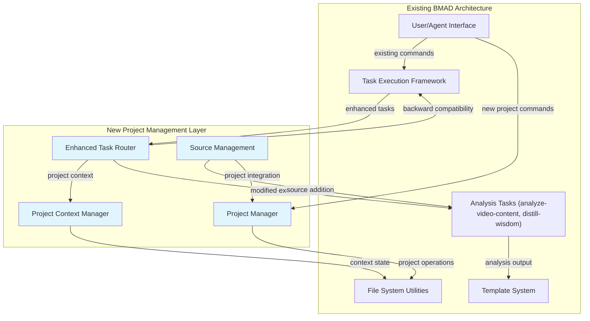

# BMAD-Method Brownfield Enhancement Architecture

## Introduction

This document outlines the architectural approach for enhancing **BMAD-Method bmad-reporting-and-writing expansion pack** with **modular, project-based research workflow management**. Its primary goal is to serve as the guiding architectural blueprint for AI-driven development of new features while ensuring seamless integration with the existing system.

**Relationship to Existing Architecture:**
This document supplements the existing BMAD Method natural language framework architecture by defining how new project management components will integrate with current expansion pack systems. Where conflicts arise between new modular patterns and existing linear workflows, this document provides guidance on maintaining backward compatibility while implementing iterative research enhancements.

### Existing Project Analysis

**Current Project State:**

- **Primary Purpose:** Comprehensive AI-powered reporting and content creation framework with 11 specialized agents, research workflows, and platform optimization
- **Current Tech Stack:** BMAD Method v4+ natural language framework, Markdown-based agent definitions, YAML configuration, Node.js build tools
- **Architecture Style:** Modular agent-based system with centralized task orchestration and linear workflow patterns
- **Deployment Method:** Expansion pack integration via BMAD installer with file-system based storage

**Available Documentation:**

- Comprehensive README with agent descriptions and workflows
- 15+ task definitions with detailed instructions and elicitation patterns
- Agent team definitions and workflow orchestration
- Template system for structured output generation
- Quality assurance checklists for content validation

**Identified Constraints:**

- Must maintain BMAD Method natural language framework principles
- Backward compatibility required for existing 11 agents and 4 workflows
- File-system based approach (no external database dependencies)
- Cross-platform path resolution requirements
- Integration with existing expansion pack build and installation system

### Change Log

| Change               | Date       | Version | Description                                                       | Author            |
| -------------------- | ---------- | ------- | ----------------------------------------------------------------- | ----------------- |
| Initial Architecture | 2025-01-09 | ARCH-v1 | Brownfield architecture creation for modular research enhancement | Architect Winston |

## Enhancement Scope and Integration Strategy

### Enhancement Overview

**Enhancement Type:** Major Feature Modification + New Feature Addition
**Scope:** Transform linear, centralized research workflows into modular, project-based system supporting iterative investigation and expandable reference management
**Integration Impact:** Significant Impact - Substantial existing code modifications with new project management layer while maintaining full backward compatibility

### Integration Approach

**Code Integration Strategy:**

- Additive layer approach - new project management tasks supplement existing workflow tasks
- Modified existing tasks (`analyze-video-content`, `distill-wisdom`, `save-transcript`) gain optional project context parameters
- Preserve existing task behavior when no project context provided
- New `project-*` tasks handle project lifecycle and context management

**Database Integration:**

- Extend file-system based approach with hierarchical project directories (`projects/{project-name}/`)
- Maintain existing `references/transcripts/` as global fallback for backward compatibility
- Project metadata stored in lightweight JSON/YAML files within project directories
- No external database dependencies introduced

**API Integration:**

- No breaking changes to existing task interfaces
- Optional project parameters added to existing task commands
- New project management commands follow existing BMAD command patterns
- Agent interfaces remain unchanged - project context flows through task execution

**UI Integration:**

- Command-line interface enhancements for project selection and status
- Project context indicators in task output and feedback
- Existing agent interaction patterns preserved
- New help sections for project-specific workflows

### Compatibility Requirements

- **Existing API Compatibility:** All current task invocations (e.g., `*analyze-video-content`, `*distill-wisdom`) continue working unchanged for non-project workflows
- **Database Schema Compatibility:** Current `references/` structure remains functional as fallback, no schema migrations required
- **UI/UX Consistency:** Project features integrate with existing command patterns, agents maintain consistent behavior and output formats
- **Performance Impact:** Minimal overhead for non-project usage, project context checking adds negligible performance cost

## Tech Stack

### Existing Technology Stack

| Category               | Current Technology   | Version  | Usage in Enhancement                             | Notes                                               |
| ---------------------- | -------------------- | -------- | ------------------------------------------------ | --------------------------------------------------- |
| **Framework**          | BMAD Method          | v4+      | Core agent orchestration and task execution      | Must maintain natural language framework principles |
| **Agent Definition**   | Markdown             | Standard | Agent persona and command definitions            | No changes to existing agents                       |
| **Configuration**      | YAML                 | Standard | Task templates, workflows, expansion pack config | Extended with project metadata                      |
| **Build System**       | JavaScript/Node.js   | v20+     | CLI tools, installers, validation                | Project management tasks auto-detected              |
| **File Processing**    | fs-extra, glob       | Current  | File system operations and pattern matching      | Enhanced for project directory management           |
| **Template Engine**    | BMAD template system | v4       | Document generation from YAML templates          | Project-aware path resolution added                 |
| **Storage**            | File system          | N/A      | Markdown files, transcripts, analysis outputs    | Hierarchical project structure added                |
| **Package Management** | npm                  | Current  | Dependency management and installation           | No new external dependencies                        |

## Data Models and Schema Changes

### New Data Models

#### Project Metadata Model

**Purpose:** Track project state, configuration, and research progress for modular workflow management
**Integration:** Lightweight JSON files stored within each project directory, no interference with existing global workflows

**Key Attributes:**

- `name`: string - Human-readable project identifier
- `created`: timestamp - Project creation date for organization
- `status`: enum - Project lifecycle state (active, review, completed, archived)
- `description`: string - Brief project purpose and scope
- `references_count`: number - Tracking metric for research scope
- `analyses_completed`: array - List of completed analysis files for progress tracking

**Relationships:**

- **With Existing:** References existing task output formats, maintains compatibility with current `references/` structure
- **With New:** Links to project-specific analysis files and research materials

#### Source Reference Model

**Purpose:** Track individual research materials within project context with metadata and analysis linkage
**Integration:** Extends existing transcript and analysis tracking with project-aware organization

**Key Attributes:**

- `url`: string - Source URL for YouTube videos or document references
- `type`: enum - Content classification (video, document, transcript, external-source)
- `added_date`: timestamp - When source was added to project
- `analysis_status`: enum - Processing state (pending, analyzing, completed, archived)
- `output_files`: array - Generated analysis and transcript file references
- `tags`: array - User-defined categorization labels for organization

**Relationships:**

- **With Existing:** Compatible with current save-transcript and analyze-video-content output patterns
- **With New:** Links to project directory structure and cross-references other project sources

### Schema Integration Strategy

**Database Changes Required:**

- **New Tables:** None - file-system based approach maintained
- **Modified Tables:** None - existing file structures preserved
- **New Indexes:** Directory-based organization provides natural indexing
- **Migration Strategy:** Zero-migration approach - existing data remains in current locations, projects created on-demand

**Backward Compatibility:**

- Existing `references/transcripts/` directory structure continues operating for non-project workflows
- Current analysis output formats and file naming preserved
- No changes to existing agent expectations or task behaviors when project context not specified

## Component Architecture

### New Components

#### Project Manager Component

**Responsibility:** Handles project lifecycle operations, directory management, and context switching for research workflow organization
**Integration Points:** Integrates with existing task execution framework, extends current command patterns used by agents

**Key Interfaces:**

- `project-init` - Creates standardized project structure with metadata initialization
- `project-switch` - Sets project context for subsequent task execution
- `project-status` - Displays project progress and analysis inventory
- `project-list` - Shows available projects with status and activity metrics

**Dependencies:**

- **Existing Components:** Uses current file system utilities (fs-extra, glob), follows existing task definition patterns
- **New Components:** Coordinates with Enhanced Task Router and Project Context Manager

**Technology Stack:** Markdown task definitions, YAML metadata files, JavaScript utilities for directory operations

#### Enhanced Task Router Component

**Responsibility:** Extends existing tasks with optional project context awareness while preserving backward compatibility
**Integration Points:** Modifies existing `analyze-video-content`, `distill-wisdom`, and `save-transcript` tasks with project parameter support

**Key Interfaces:**

- Project-aware file path resolution for analysis outputs
- Optional project parameter handling in existing task commands
- Automatic context detection and routing decisions
- Backward compatibility mode for non-project usage

**Dependencies:**

- **Existing Components:** Current task execution framework, existing agent command interfaces
- **New Components:** Project Context Manager for state management

**Technology Stack:** Enhanced markdown task definitions with conditional project logic, existing YAML template system

#### Project Context Manager Component

**Responsibility:** Manages active project state, provides project-aware path resolution, and maintains context persistence
**Integration Points:** Transparent integration with existing agent execution - no agent modifications required

**Key Interfaces:**

- Active project context storage and retrieval
- Project-aware path resolution for file operations
- Context validation and error handling
- Session-based context persistence

**Dependencies:**

- **Existing Components:** Current configuration system, existing file path utilities
- **New Components:** Project Manager for metadata access

**Technology Stack:** JSON configuration files, existing BMAD configuration patterns

#### Source Management Component

**Responsibility:** Handles iterative addition of research materials to existing projects with automatic analysis triggering
**Integration Points:** Coordinates with existing analysis tasks, maintains current transcript and analysis output formats

**Key Interfaces:**

- `project-add-source` - Integrates new materials into project structure
- Automatic content type detection and analysis routing
- Duplicate source detection and prevention
- Cross-project reference discovery

**Dependencies:**

- **Existing Components:** Current `save-transcript` and `analyze-video-content` tasks, existing content analysis workflows
- **New Components:** Project Manager for directory operations, Enhanced Task Router for analysis execution

**Technology Stack:** Extends existing task patterns, uses current content analysis capabilities

### Component Interaction Diagram



## Source Tree

### Existing Project Structure

```plaintext
expansion-packs/bmad-reporting-and-writing/
├── README.md
├── agents/                    # 11 specialized agents
├── agent-teams/              # Team bundles
├── checklists/               # Quality assurance checklists
├── config.yaml              # Expansion pack configuration
├── data/                     # Knowledge base files
├── docs/                     # Documentation
├── tasks/                    # 15+ research and analysis tasks
├── templates/                # 7 professional templates
└── workflows/                # 4 complete workflows
```

### New File Organization

```plaintext
expansion-packs/bmad-reporting-and-writing/
├── README.md
├── agents/                    # Existing agents (unchanged)
├── agent-teams/              # Existing teams (unchanged)
├── checklists/               # Existing checklists (unchanged)
├── config.yaml              # Extended with project settings
├── data/                     # Existing data files (unchanged)
├── docs/                     # Existing documentation (unchanged)
├── tasks/                    # Enhanced and new tasks
│   ├── analyze-video-content.md     # Enhanced with project context
│   ├── distill-wisdom.md            # Enhanced with project context
│   ├── save-transcript.md           # Enhanced with project context
│   ├── project-init.md              # New - project initialization
│   ├── project-switch.md           # New - context management
│   ├── project-list.md              # New - project listing
│   ├── project-status.md            # New - progress tracking
│   ├── project-add-source.md        # New - iterative source addition
│   ├── project-search.md            # New - cross-project discovery
│   └── project-archive.md           # New - lifecycle management
├── templates/                # Existing templates (unchanged)
└── workflows/                # Existing workflows (unchanged)
```

### Integration Guidelines

- **File Naming:** Maintain current kebab-case convention, prefix new project tasks with `project-`
- **Folder Organization:** No changes to existing structure, new project tasks integrate into existing `tasks/` directory
- **Import/Export Patterns:** Follow existing task dependency patterns, maintain BMAD framework conventions for cross-task references

## Infrastructure and Deployment Integration

### Existing Infrastructure

**Current Deployment:** Expansion pack distributed via BMAD installer, integrated with core framework through config.yaml registration
**Infrastructure Tools:** npm for dependency management, Node.js build tools for validation and packaging
**Environments:** Development (local editing), build (npm run build), distribution (expansion pack installation)

### Enhancement Deployment Strategy

**Deployment Approach:** Zero-infrastructure-change deployment - enhancements distributed through existing BMAD expansion pack installation system
**Infrastructure Changes:** None required - uses existing file system and build processes
**Pipeline Integration:** New tasks auto-detected by existing BMAD build system, follows current validation and packaging patterns

### Rollback Strategy

**Rollback Method:** File-based rollback - remove new project tasks, existing tasks maintain backward compatibility
**Risk Mitigation:** Backward compatibility ensures existing workflows continue operating if enhancement needs to be disabled
**Monitoring:** Standard BMAD task validation and user feedback through existing channels

## Testing Strategy

### Integration with Existing Tests

**Existing Test Framework:** BMAD Method relies on validation through task execution and user feedback rather than traditional unit testing
**Test Organization:** Task-based validation through workflow execution and output verification
**Coverage Requirements:** All existing tasks must continue operating unchanged when no project context provided

### New Testing Requirements

#### Unit Tests for New Components

- **Framework:** Manual task execution and output validation following BMAD patterns
- **Location:** Test execution within development environment
- **Coverage Target:** All project management tasks validated with sample projects
- **Integration with Existing:** Project-enhanced tasks tested in both project and non-project modes

#### Integration Tests

- **Scope:** Cross-task workflow validation ensuring project context flows correctly between operations
- **Existing System Verification:** All existing tasks verified to produce identical output in non-project mode
- **New Feature Testing:** End-to-end project workflows tested from initialization through archival

#### Regression Testing

- **Existing Feature Verification:** All existing expansion pack workflows validated to ensure no disruption
- **Automated Regression Suite:** Task validation through existing BMAD build system
- **Manual Testing Requirements:** User workflow testing for both existing and enhanced capabilities

## Security Integration

### Existing Security Measures

**Authentication:** No authentication required - file-system based operations follow user permissions
**Authorization:** Standard file system permissions control access to project directories and analysis outputs  
**Data Protection:** No sensitive data storage - research materials and analysis outputs stored as plain text files
**Security Tools:** Relies on operating system security and file system permissions

### Enhancement Security Requirements

**New Security Measures:** No additional security measures required - project management follows existing file-system security model
**Integration Points:** Project directories inherit user file system permissions, no network or database security concerns
**Compliance Requirements:** Maintains existing security posture with no additional compliance requirements

### Security Testing

**Existing Security Tests:** File system permission validation through normal usage
**New Security Test Requirements:** Verify project directories respect user permissions and cross-platform path security
**Penetration Testing:** Not applicable - no network services or authentication mechanisms introduced

## Coding Standards

### Existing Standards Compliance

**Code Style:** Markdown-based task definitions following BMAD Method natural language framework conventions
**Linting Rules:** YAML validation for configuration files, markdown structure validation for task definitions
**Testing Patterns:** Task execution validation and output verification through workflow testing
**Documentation Style:** Comprehensive inline documentation within task files, README-based user guidance

### Enhancement-Specific Standards

- **Project Task Naming:** All new project management tasks prefixed with `project-` (e.g., `project-init.md`, `project-switch.md`)
- **Backward Compatibility Validation:** All modified tasks must maintain identical behavior when no project context provided
- **Project Context Handling:** Consistent optional parameter patterns across all project-enhanced tasks
- **Error Handling Integration:** Project context errors follow existing BMAD task error reporting patterns

### Critical Integration Rules

- **Existing API Compatibility:** All current task invocations continue working unchanged, optional project parameters added without breaking existing usage
- **Database Integration:** File-system based approach maintained, project metadata stored in standard JSON/YAML formats
- **Error Handling:** Project context errors reported through existing task feedback mechanisms, no new error handling patterns introduced
- **Logging Consistency:** Project operations logged through existing task execution patterns, maintains current verbosity and format standards

## Next Steps

### Story Manager Handoff

**For Scrum Master collaboration:**

"Begin implementation of the modular research project management enhancement for bmad-reporting-and-writing expansion pack. Reference the completed architecture document at `docs/architecture.md` and sharded PRD in `docs/prd/`.

Key integration requirements validated with user:

- Maintain full backward compatibility with existing 11 agents and 4 workflows
- Use additive layer approach with optional project context parameters
- Follow existing BMAD Method natural language framework patterns
- Implement file-system based project organization without external dependencies

Existing system constraints based on actual project analysis:

- Centralized `references/transcripts/` structure must remain functional as fallback
- Task-based architecture where agents execute markdown workflows unchanged
- Cross-platform file path resolution requirements
- Integration with existing expansion pack build and installation system

First story to implement: Story 1.1 - Project Infrastructure Foundation with clear integration checkpoints:

- Validate project directory creation doesn't interfere with existing workflows
- Verify project metadata storage follows BMAD configuration patterns
- Ensure existing tasks continue unchanged operation when no project context active

Emphasis on maintaining existing system integrity throughout implementation - each story must preserve all current functionality while adding new capabilities."

### Developer Handoff

**For development team starting implementation:**

"Begin development of modular research project management for bmad-reporting-and-writing expansion pack. Reference architecture document at `docs/architecture.md` and existing coding standards analyzed from actual project.

Integration requirements with existing codebase validated with user:

- All new project tasks follow existing markdown task definition patterns found in `tasks/` directory
- Enhanced existing tasks (`analyze-video-content.md`, `distill-wisdom.md`, `save-transcript.md`) maintain current interfaces with optional project parameters
- Project management uses existing file system utilities (fs-extra, glob) and YAML configuration patterns

Key technical decisions based on real project constraints:

- No external dependencies added - use existing BMAD Method v4+ framework capabilities
- File-system based project storage in `projects/{project-name}/` hierarchy
- Backward compatibility maintained through conditional project context handling
- Cross-platform support using existing path resolution patterns

Existing system compatibility requirements with specific verification steps:

- Test all existing task invocations produce identical results when no project context provided
- Verify existing agent workflows continue without modification when using enhanced tasks
- Validate project context parameter handling doesn't break existing command patterns

Clear sequencing of implementation to minimize risk to existing functionality:

1. Start with Story 1.1 - Project Infrastructure Foundation (project-init, project-list)
2. Proceed to Story 1.2 - Project-Aware Task Enhancement (modify existing tasks)
3. Continue with Story 1.3 - Project Context Management (project-switch, project-status)
   Each story must be fully tested for backward compatibility before proceeding to next."
